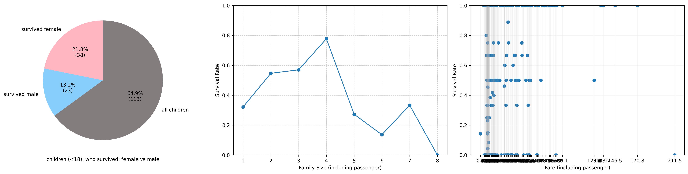
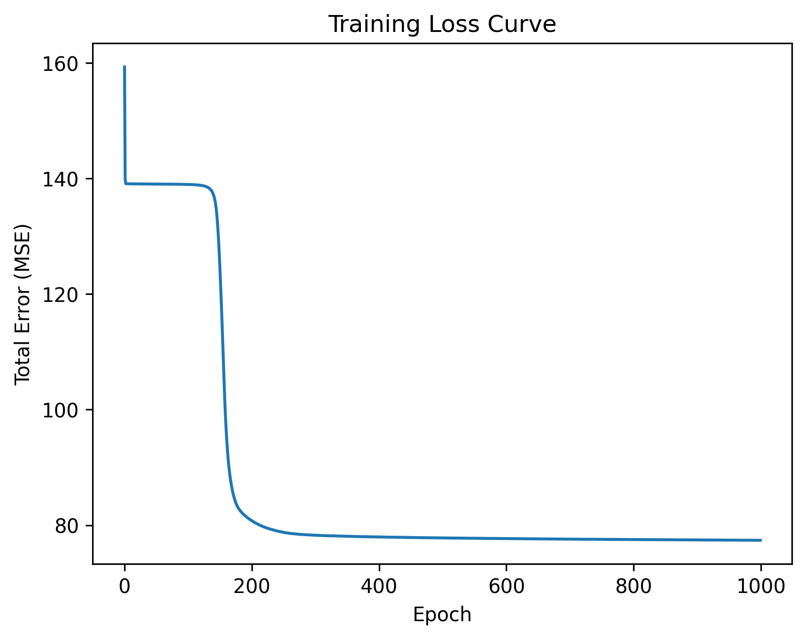
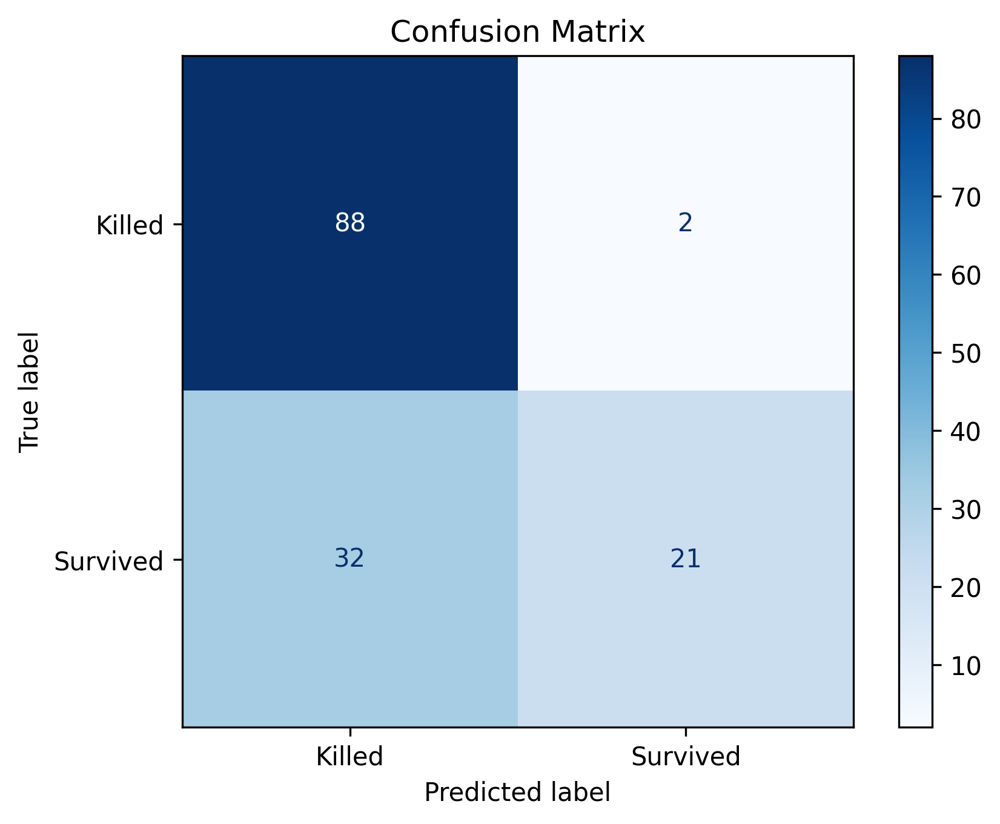

# 🧠 Custom Neural Network System — Titanic Case Study
## 🌍 Overview

This project demonstrates a custom-built neural network system designed entirely from scratch using NumPy — no TensorFlow, PyTorch, or other ML frameworks.

While the Titanic dataset is used for testing, the true purpose of this project is to create a general-purpose, extensible deep learning system that can later be adapted for more complex problems such as medical data, risk modeling, or financial prediction.

⚙️ Key Features

### ✅ Fully Custom Implementation

- Forward and backward propagation written manually
- Weight initialization and gradient updates
- ReLU and Sigmoid activations
- Mini-batch learning
- Binary cross-entropy loss
- Custom metrics: accuracy, precision, recall

### ✅ TensorFlow Comparison
- Includes a benchmark model using TensorFlow/Keras for comparison
- Demonstrates how the handcrafted network achieves similar or better interpretability and control

### ✅ Transparent & Modular Design
- Every layer and activation function is explicit and editable
- Built for education, debugging, and research — not as a black box

### 🧩 Model Architecture
Layer	Type	Activation	Description
Input	5 neurons	—	Encodes Pclass, Sex, Age, Fare, FamilySize
Hidden 1	Dense (8)	ReLU	Extracts nonlinear relationships
Hidden 2	Dense (5)	ReLU	Learns higher-level interactions
Hidden 2	Dense (3)	ReLU	Learns higher-level interactions
Output	Dense (1)	Sigmoid	Predicts survival probability (0–1)

## 📊 Results & Comparisons
Metric	    Custom System	TensorFlow
Accuracy	0.83	        0.81
Precision	0.77	        0.75
Recall	    0.71	        0.69

(Values vary by seed and training conditions.)

## 🖼️ Visualizations
1. Data Overview

Description: Shows the distribution of age, fare, and passenger class across the Titanic dataset. This helps to visually understand data imbalance and feature correlation before training.

2. Training Loss Curve

Description: Displays training and validation loss over epochs. A steadily decreasing loss curve indicates convergence and proper gradient updates.

3. Confusion Matrix

Description: Provides a visual breakdown of correct and incorrect predictions — showing how well the model distinguishes between survivors and non-survivors.

## 🧠 Why Build It From Scratch?

Most ML frameworks abstract away the low-level operations — which makes experimentation difficult.
This system offers total transparency and mathematical control, enabling:
- Fine-grained manipulation of learning rates
- Debugging of gradient flow
- Implementation of novel optimization algorithms
- Understanding of why the network behaves as it does

## 🚀 The result: 
a custom system capable of matching or outperforming standard solutions in controlled settings — and far easier to extend or explain.
